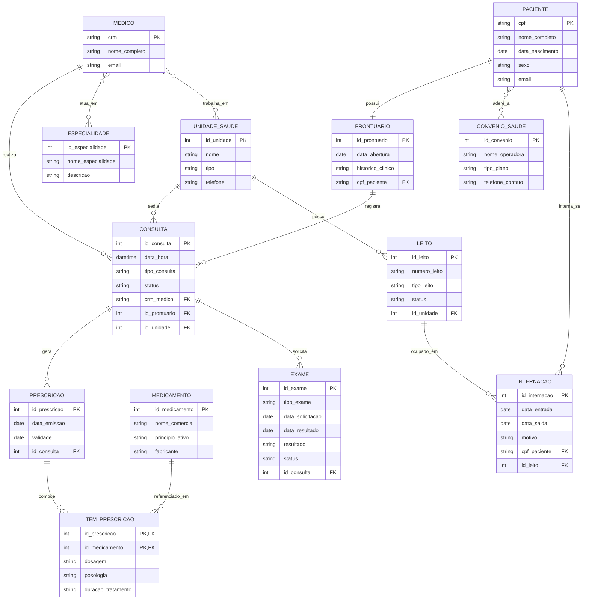

# Modelagem Conceitual — Sistema de Gestão de Saúde (SGS)

## 1. Entidades

| Entidade | Definição |
|---|---|
| **Paciente** | Pessoa que recebe atendimento na rede de saúde (consultas, exames, internações). |
| **Médico** | Profissional de saúde responsável por realizar consultas, prescrever medicamentos e solicitar exames. |
| **Especialidade** | Área de atuação médica (ex: Cardiologia, Pediatria, Ortopedia) na qual um médico pode ser habilitado. |
| **UnidadeSaude** | Estabelecimento da rede (hospital, UBS, clínica ou laboratório) onde ocorrem os atendimentos. |
| **Consulta** | Registro de um atendimento médico agendado/realizado entre um paciente e um médico em uma unidade, em determinada data/hora. |
| **Prontuário** | Registro clínico único e contínuo de um paciente, que concentra seu histórico de consultas. |
| **Prescrição** | Documento emitido em uma consulta contendo os medicamentos indicados ao paciente. |
| **ItemPrescrição** | Entidade associativa que representa cada medicamento dentro de uma prescrição, com sua dosagem e posologia específicas. |
| **Medicamento** | Fármaco cadastrado no sistema que pode ser prescrito a pacientes. |
| **Exame** | Procedimento diagnóstico solicitado em uma consulta, com resultado a ser registrado. |
| **ConvenioSaude** | Plano/operadora de saúde ao qual um paciente pode estar vinculado. |
| **Internação** | Registro de permanência de um paciente em um leito por um período, decorrente de um atendimento. |
| **Leito** | Unidade física de acomodação de pacientes internados, pertencente a uma unidade de saúde. |

---

## 2. Relacionamentos e Cardinalidades

1. **[Paciente] (1,1) `possui` (1,1) [Prontuário]**
   Todo paciente possui exatamente um prontuário, e todo prontuário pertence a exatamente um paciente.

2. **[Prontuário] (1,1) `registra` (0,N) [Consulta]**
   Um prontuário pode registrar nenhuma ou várias consultas ao longo do tempo; cada consulta pertence a um único prontuário.

3. **[Médico] (1,1) `realiza` (0,N) [Consulta]**
   Um médico pode realizar diversas consultas; cada consulta é realizada por um único médico.

4. **[UnidadeSaude] (1,1) `sedia` (0,N) [Consulta]**
   Uma unidade de saúde sedia diversas consultas; cada consulta ocorre em uma única unidade.

5. **[Médico] (0,N) `atua em` (0,N) [Especialidade]**
   Um médico pode ter uma ou mais especialidades, e uma especialidade pode ser exercida por vários médicos (relacionamento N:N).

6. **[Médico] (0,N) `trabalha em` (0,N) [UnidadeSaude]**
   Um médico pode atender em várias unidades de saúde, e uma unidade conta com vários médicos (relacionamento N:N).

7. **[Consulta] (1,1) `gera` (0,N) [Prescrição]**
   Uma consulta pode gerar nenhuma, uma ou várias prescrições; cada prescrição está vinculada a uma única consulta.

8. **[Prescrição] (1,1) `é composta por` (1,N) [ItemPrescrição]**
   Toda prescrição possui pelo menos um item; cada item pertence a uma única prescrição.

9. **[ItemPrescrição] (0,N) `refere-se a` (1,1) [Medicamento]**
   Cada item de prescrição refere-se a exatamente um medicamento; um medicamento pode aparecer em vários itens de diferentes prescrições.

10. **[Consulta] (1,1) `solicita` (0,N) [Exame]**
    Uma consulta pode solicitar nenhum ou vários exames; cada exame solicitado está vinculado a uma única consulta.

11. **[Paciente] (0,N) `adere a` (0,N) [ConvenioSaude]**
    Um paciente pode não ter convênio, ter um ou possuir vários (ex: plano principal + odontológico); um convênio atende a muitos pacientes (relacionamento N:N — carrega os atributos `numero_carteirinha` e `data_adesao`).

12. **[Paciente] (1,1) `interna-se em` (0,N) [Internação]**
    Um paciente pode ter nenhuma ou várias internações ao longo da vida; cada internação pertence a um único paciente.

13. **[Leito] (1,1) `é ocupado em` (0,N) [Internação]**
    Um leito pode ser ocupado por diversas internações ao longo do tempo (nunca simultaneamente); cada internação ocupa exatamente um leito.

14. **[UnidadeSaude] (1,1) `possui` (0,N) [Leito]**
    Uma unidade de saúde possui vários leitos; cada leito pertence a uma única unidade.

---

## 3. Sugestão de Atributos

### Paciente
- **`cpf`** (PK)
- `nome_completo`
- `data_nascimento`
- `sexo`
- `telefone` — *multivalorado* (paciente pode ter mais de um contato)
- `endereco` — *composto* (logradouro, número, bairro, cidade, UF, CEP)
- `email`
- `idade` — *derivado* (calculado a partir de `data_nascimento`)

### Médico
- **`crm`** (PK)
- `nome_completo`
- `telefone` — *multivalorado*
- `email`

### Especialidade
- **`id_especialidade`** (PK)
- `nome_especialidade`
- `descricao`

### UnidadeSaude
- **`id_unidade`** (PK)
- `nome`
- `tipo` (hospital, UBS, laboratório, clínica)
- `endereco` — *composto*
- `telefone`

### Consulta
- **`id_consulta`** (PK)
- `data_hora`
- `tipo_consulta` (rotina, emergência, retorno)
- `status` (agendada, realizada, cancelada)
- `crm_medico` (FK)
- `id_prontuario` (FK)
- `id_unidade` (FK)

### Prontuário
- **`id_prontuario`** (PK)
- `data_abertura`
- `historico_clinico`
- `cpf_paciente` (FK)

### Prescrição
- **`id_prescricao`** (PK)
- `data_emissao`
- `validade` — *derivado* (`data_emissao` + prazo padrão)
- `id_consulta` (FK)

### ItemPrescrição
- **`id_prescricao` + `id_medicamento`** (PK composta)
- `dosagem`
- `posologia` (frequência de uso)
- `duracao_tratamento`

### Medicamento
- **`id_medicamento`** (PK)
- `nome_comercial`
- `principio_ativo`
- `fabricante`

### Exame
- **`id_exame`** (PK)
- `tipo_exame`
- `data_solicitacao`
- `data_resultado`
- `resultado`
- `status` (pendente, concluído)
- `id_consulta` (FK)

### ConvenioSaude
- **`id_convenio`** (PK)
- `nome_operadora`
- `tipo_plano`
- `telefone_contato`
- *(atributos do relacionamento com Paciente: `numero_carteirinha`, `data_adesao`)*

### Internação
- **`id_internacao`** (PK)
- `data_entrada`
- `data_saida`
- `motivo`
- `tempo_internacao` — *derivado* (`data_saida` − `data_entrada`)
- `cpf_paciente` (FK)
- `id_leito` (FK)

### Leito
- **`id_leito`** (PK)
- `numero_leito`
- `tipo_leito` (enfermaria, UTI, isolamento)
- `status` — *derivado* (ocupado/livre, conforme internação ativa)
- `id_unidade` (FK)

---

## 4. Diagrama Entidade e Relacionamento (DER)

> **Observação:** o relacionamento N:N entre `Paciente` e `ConvenioSaude` carrega atributos próprios (`numero_carteirinha`, `data_adesao`). No modelo lógico, esse relacionamento se converterá em uma tabela associativa (ex: `PacienteConvenio`), da mesma forma como `ItemPrescricao` já resolve, no nível conceitual, o relacionamento N:N entre `Prescrição` e `Medicamento`.
